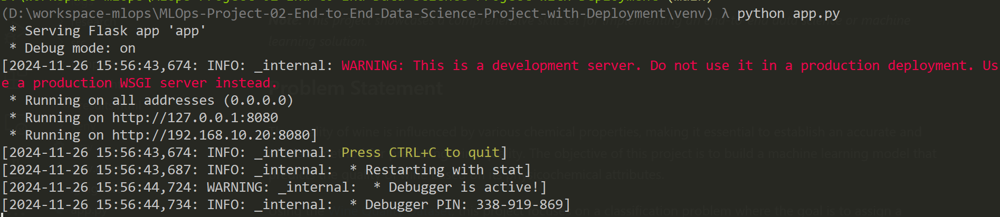
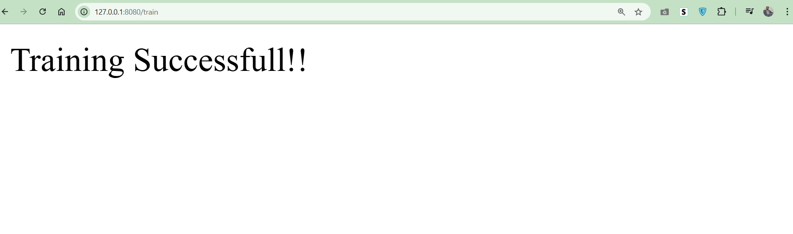
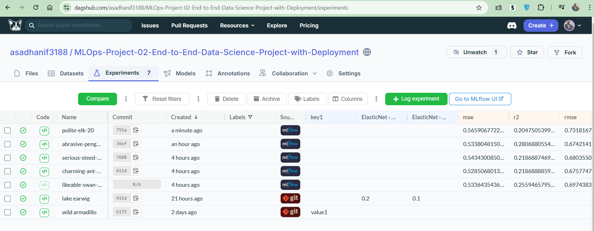
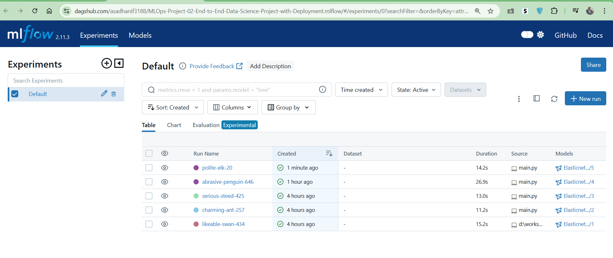
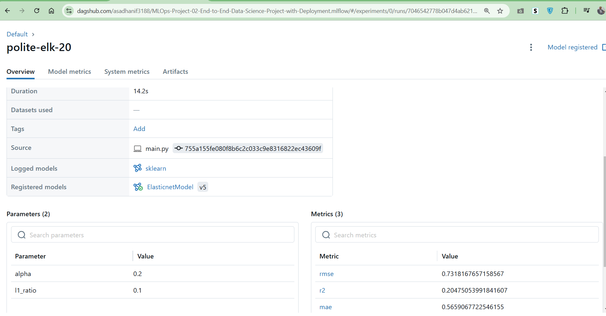
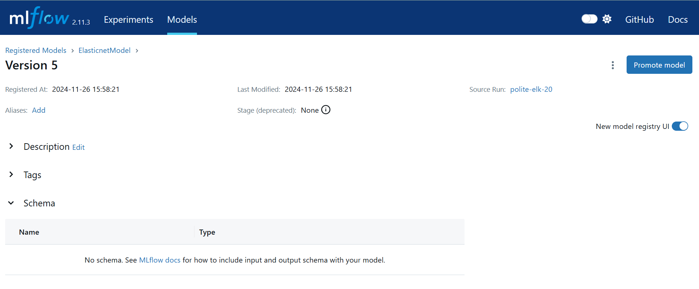
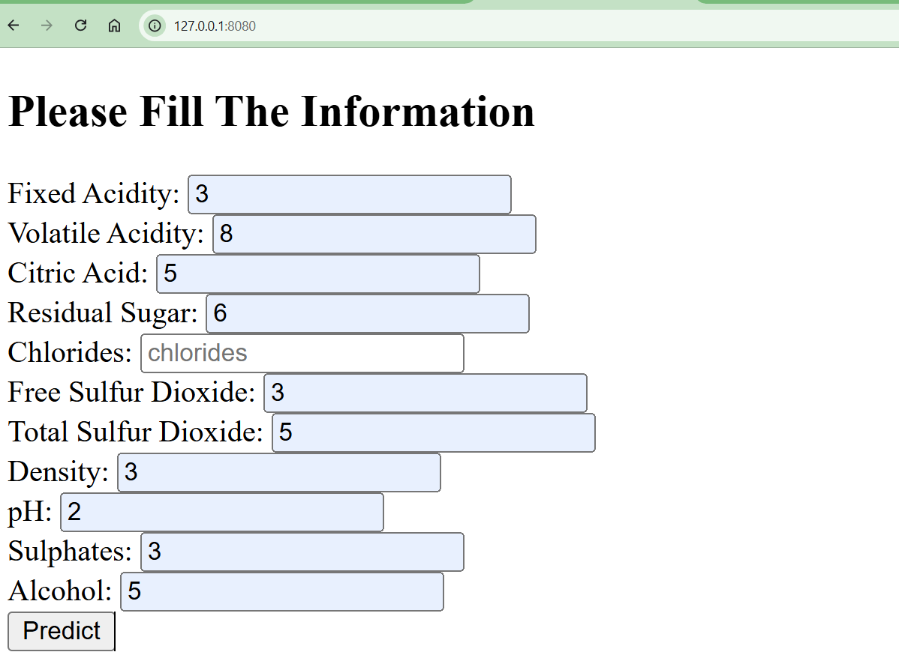
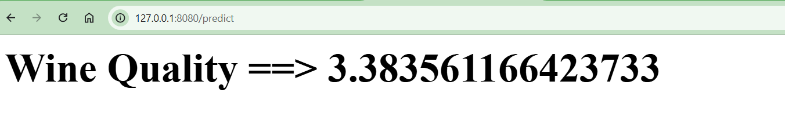

# MLOps Project 02 -- End-to-End Data Science Project with Deployment

***Note:*** *This project showcases a comprehensive skill set for implementing an end-to-end data science or machine learning solution.*

## Problem Statement 
The quality of wine is influenced by various chemical properties, making it essential to establish an accurate and efficient method for predicting wine quality. The objective of this project is to build a machine learning model that predicts the quality of wine based on its physicochemical attributes.

Using the [Wine Quality Dataset](https://www.kaggle.com/datasets/yasserh/wine-quality-dataset), this project focuses on a classification problem where the goal is to assign a quality score (from a predefined range) to a wine sample. By leveraging data preprocessing, feature engineering, and model training techniques, the solution aims to assist wine producers and quality control teams in automating the evaluation process, ensuring consistency and efficiency in quality assessment.

## Few Screenshots

Running ML Application as a Flask Application. 


Hiting the training endpoint of Flask app, `127.0.0.1:8080/train`


Model's experiment tracking UI at DagsHub.


Model's experiment tracking MLFlow UI.


Model's parameters and metrics


Registered model at MLFlow


Basic UI for data input for prediction.


Predicted result demo.


----------------------------
## Key Features
This project highlights the following key features:

- **Data Ingestion and Preprocessing:**
Automated pipelines for data collection, validation, cleaning, and transformation.

- **Modular Programming:**
Well-structured, reusable, and maintainable code components for scalability and ease of debugging.

- **Standardized Project Structure:**
A `template.py` script has been developed to automate the creation of a consistent and production-ready project directory and file structure.

- **Model Training and Evaluation:**
Efficient workflows for model training, hyperparameter tuning, and performance evaluation using robust metrics.

<!-- - **Experiment Tracking:**
Integration with tools like MLflow, Weights & Biases, or TensorBoard to monitor experiments and results. -->

- **Version Control:**
Data and model versioning using DVC or other tools to ensure reproducibility and traceability.

<!-- - **CI/CD Pipelines:**
Automated testing, deployment, and integration processes leveraging tools like GitHub Actions, Jenkins, or Azure DevOps. -->

- **Model Deployment:**
Seamless deployment of machine learning models using FastAPI, Flask, or Kubernetes, ensuring high availability and scalability.

<!-- - **Monitoring and Logging:**
Real-time monitoring of deployed models for performance and drift detection, supported by structured logging. -->

<!-- - **Cloud Integration:**
Deployment and scalability powered by cloud platforms like AWS, Azure, or Google Cloud Platform (GCP). -->

<!-- - **Security and Compliance:**
Implementation of secure APIs, role-based access controls, and compliance with data privacy standards. -->

<!-- - **Scalable Storage Solutions:**
Efficient handling of large datasets with tools like Amazon S3, Google Cloud Storage, or Azure Blob Storage. -->

<!-- - **Visualization Dashboards:**
Interactive dashboards using tools like Streamlit or Dash to present key insights and metrics. -->

<!-- - **Automation and Orchestration:**
Workflow automation with tools like Apache Airflow, Prefect, or Dagster for streamlined pipeline execution. -->


## Workflows -- ML Pipeline
1. Data Ingestion
2. Data Validation
3. Data Transformation
    - Feature Engineering 
    - Data Preprocessing 
4. Model Trainer
5. Model Evaluation 
    - MLFLow
    - DagsHub 


### Workflow Steps
1. Update `config/config.yaml`
2. Update `schema.yaml`
3. Update `params.yaml`
4. Update the entity
5. Update the configuration manager in src config 
6. Update the components 
7. Update the pipeline 
7. Update the `main.py`


## Environment Setup Instructions
1. **Clone the repo:**
```
git clone <repo-link>  
cd MLOps-Project-02-End-to-End-Data-Science-Project-with-Deployment  
```

2. **Environment Setup:**
Setup conda virtual environment using following command.
```
conda create -p venv python==3.12 
```

3. **Activate Environment:**
To activate conda virtual environment use following command.
```
conda activate venv\ 
```

4. **Install Libraries:**
To install libraries use following command.
```
pip install -r requirements.txt
```

5. **Deactivate Environment:**
To deactivate conda virtual environment use following command.
```
conda deactivate
```

